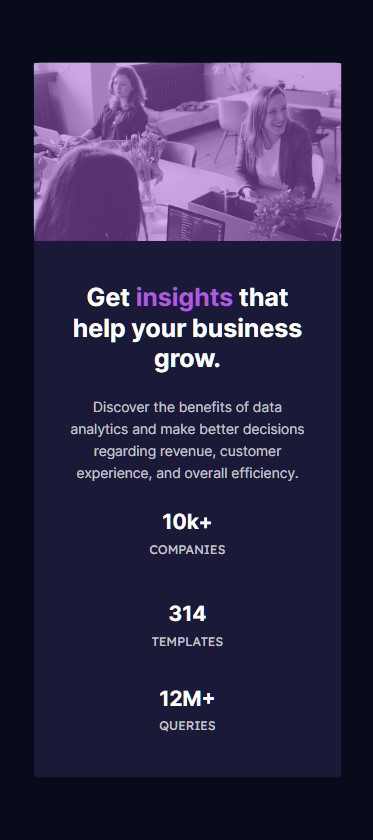

# Frontend Mentor - Stats preview card component solution

This is a solution to the [Stats preview card component challenge on Frontend Mentor](https://www.frontendmentor.io/challenges/stats-preview-card-component-8JqbgoU62). Frontend Mentor challenges help you improve your coding skills by building realistic projects.

## Table of contents

- [Overview](#overview)
  - [The challenge](#the-challenge)
  - [Screenshot](#screenshot)
  - [Links](#links)
- [My process](#my-process)
  - [Built with](#built-with)
  - [What I learned](#what-i-learned)
  - [Continued development](#continued-development)
  - [Useful resources](#useful-resources)
- [Author](#author)
- [Acknowledgments](#acknowledgments)

**Note: Delete this note and update the table of contents based on what sections you keep.**

## Overview

### The challenge

Users should be able to:

- View the optimal layout depending on their device's screen size

### Screenshot

### Links

- Solution URL: [Add solution URL here](https://github.com/MonetCode88/Stats-preview-card-component-main)
- Live Site URL: [Add live site URL here](https://monetcode88.github.io/Stats-preview-card-component-main/)

## My process

For this project started with the desktop design first and then moved to the mobile design which isn't the right way admittedly. I had some trouble to getting the bottom row of the info card to align properly. But after some research it did end up working the way I expected.

### Built with

- Semantic HTML5 markup
- CSS custom properties
- Flexbox

### What I learned

For this project, I designed the project backwards in doing desktop first and not mobile thus leading to some issues when I started on the mobile design. So my major takeaway is I definitely need to design with mobile first
also I feel like I became much more profecient in using the proper css classes to position things properly in contrast to my last project.

If you want more help with writing markdown, we'd recommend checking out [The Markdown Guide](https://www.markdownguide.org/) to learn more.

### Continued development

I really want to focus on media queries and get good at using them properly.

### Useful resources

- [Example resource 1](https://developer.mozilla.org/en-US/ - This has been my go to for trying to find info especially for the flexbox property which was kicking my ass.)
- [Example resource 2](https://stackoverflow.com/) - Always a go-to for me just interacting with devs and asking questions.
- [Example resource 2](https://www.w3schools.com/)

## Author

- Frontend Mentor - [@MonetCode88](https://www.frontendmentor.io/profile/MonetCode88)

**Note: Delete this note and add/remove/edit lines above based on what links you'd like to share.**

## Acknowledgments

This is where you can give a hat tip to anyone who helped you out on this project. Perhaps you worked in a team or got some inspiration from someone else's solution. This is the perfect place to give them some credit.

**Note: Delete this note and edit this section's content as necessary. If you completed this challenge by yourself, feel free to delete this section entirely.**
